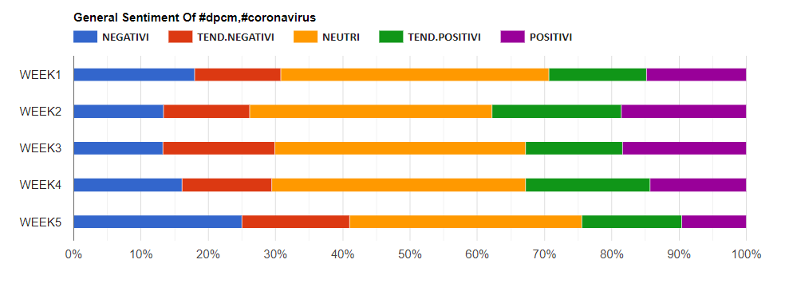

# Twitter Sentimment Analysis in Italy During Covid-19

Geographic Networks Project, focused on the Sentiment Analysis of Tweets acquired via API.

To start the Web-App, carry out the following operations from the terminal from the Twitter-Sentiment-Analysis-during-Covid-19 folder:

```
cd prog-vue
npm install
npm run serve
```

# Description

Given the current situation characterized by the pandemic phenomenon of Covid-19, we want to carry out Sentiment Analysis, through Twitter, to understand what the population thinks about it, focusing on how it reacted following the various government decisions (dpcm, etc.).
Through Twitter, we have decided to capture tweets (referring to their retweets) with certain hashtags. To do this, it was necessary to create specific accounts on Twitter Developer, necessary to have the API available from the social network itself. Subsequently, after several meetings, it was decided to create a permanent copy of the tweets captured using a database.
For the visualization of the results, which represent the general sentiment of the population, there were various possible developments such as:
- Java application
- Python application
- Excel sheet
- Web application

After a careful study of feasibility, the choice fell on the more complex implementation but at the same time more user-friendly, so as to allow a detailed view of the data collected.

# Limits

In the realization of the project there was the presence of various limitations, which have oriented our developments in ways that depend on them.
The limitations mainly concerned:

- **Twitter Developer API**: The API provided by Twitter provides several useful functions, but with limited uses. This is the case, for example, of the availability of data in the past, in fact in our case it is not possible to acquire tweets before seven days from the current date. A further limitation is characterized by the speed limit of requests per second and the monthly extraction of tweets.

- **Azure Text Analytics**: This tool, as mentioned above, has been discarded as it has limitations mainly due to the Azure subscription plan. Being a “For Students” account it gives the possibility to test this service, but in a very limited way. In our case it could not therefore be used given the disproportionate number of tweets captured, as the limit set is a maximum of 10 records per request.

- **HTTP Error 429 - Too Many Requests**: Given the limitation inherent in too many requests in a given period of time, which generates an error 429, we used a VPN to be able to send the sentiment of the captured tweets. Taking advantage of a monthly free trial of the Seed4.me software, we had a series of IP addresses associated with various countries. To fix this error, therefore every time the number of requests was exceeded, the IP address was manually changed and the script was run again. This made it possible to complete all requests without having to wait for the time limits established by the limitation.

- **Imponderable Factors**: In addition to the various technical limitations, semantic / syntactic limitations of the sentences present within the tweets were found. These limitations are:
▪ Grasp the irony and sarcasm
▪ Translate dialects
▪ Grammatical and spelling errors
▪ Abbreviated words

# Project Objectives

- Identification of the main trending hashtags: We proceeded to identify the most used hashtags regarding the Covid-19 topic, evaluating various categories of interest.
- Tweets capture and storage: Tweets were captured weekly and subsequently saved in a database.
- Sentiment of the acquired data: Once the data were obtained, they were processed thus obtaining the values associated with each tweet.
- Study and data processing: The final data have been studied to obtain results and answers regarding the problem.

# Design

The methodology used envisages obtaining the opinions through appropriate hashtags, in particular all the tweets that referred to them were acquired. 20 trending hashtags were identified that belonged to various categories of our interest and that respected certain popularity parameters.
Once established the most widespread and used hashtags, we proceeded with the writing of a script in Python that allows the acquisition of tweets within a certain period of time, this can be done using the Tweepy library. Subsequently, the acquired data are made persistent and inserted into a non-relational database (MongoDB), using the specific PyMongo library. The captured tweets are translated from Italian to English through the use of TextBlob. This translation is done using a VPN, which allows you to make a large number of unlimited requests. We then move on to sentiment analysis through Vader Sentiment. The data collected and processed will be analyzed and shown in a Web app, developed using Vue.js and Google Charts, for the creation and display of various types of graphs.

# Technologies and Environments Used

The technologies identified for the realization of the set objectives are different. First of all, this project was developed taking into consideration three factors of interest: a computational approach, the persistence of the data and the representation of the information collected. This ensured an easy and targeted management of the components, allowing an intuitive realization without any impediments. The main technologies used are listed below.

- Python
- Tweepy
- PyMongo
- Vader Sentiment
- TextBlob

# Architecture Binding

The following conceptual map illustrates the various technologies and components that interact with each other:


# Graphical Data Display

La visualizzazione dei dati è stata ottenuta prendendo in considerazione le seguenti categorie. Per ognuna di esse, sono stati estrapolati i rispettivi hashtags:

- Colori Regioni:


- Negazionisti:


- Sanità:


- Governo:


- Positivisti:


- Scuola:


- Periodo Natalizio:


- Congiunti


- Covid-19



# Conclusions

Despite the difficulties already described above and the existence of imponderable factors, it was still possible to collect and analyze the data, thus obtaining important answers to the problem. For a detailed view of the conclusions, the "General Sentiment" graph was used:
It describes the general sentiment of all hashtags analyzed for the project. It is the graph that provides a precise answer to the question:


Analyzing all the hashtags and considering different "sectors" of interest, the sentiment average turns out to be constantly neutral. In fact, it can be noted that the Sentiment tends to be slightly positive, while maintaining a strong prevalence of neutrality. 

In detail, the results obtained are:

- Negatives: 16.4%
- Trending Negative: 15.5%
- Positive Trending: 18.1%
- Positive: 17.1%

In conclusion, from the percentages obtained, it is possible to deduce a Positivity equal to 35.2% and a Negativity of 31.9%. We can therefore affirm that, during the period studied, the population reacted fairly favorably to the various government decisions.
